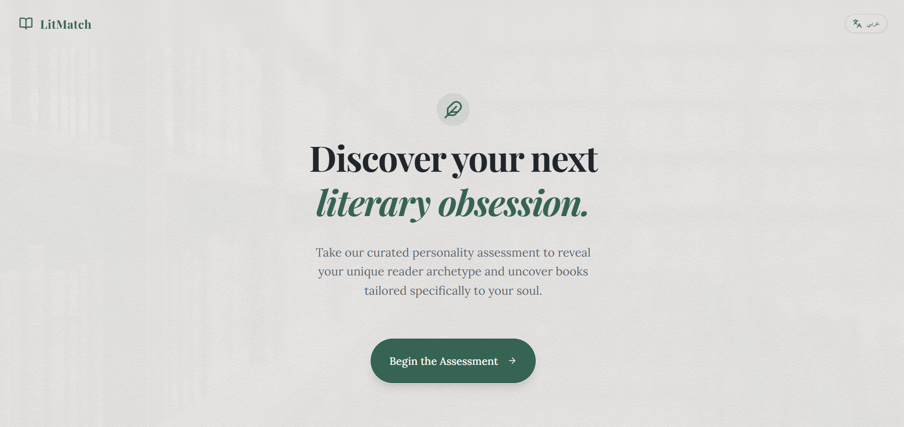

# LitMatch — AI Book Matchmaker

A personality-driven book recommendation app available in English and Arabic.

**Live Demo:** [ai-book-matchmaker.vercel.app](https://ai-book-matchmaker.vercel.app)

---

## About

LitMatch matches readers with books based on personality, mood, and interests.
Answer 8 questions and receive your unique reader archetype along with 5 curated 
book recommendations — a mix of English and Arabic literature.

No sign-up required. Fully client-side.

---

## Features

- 8-question personality quiz covering mood, goals, and reading habits
- 7 distinct reader archetypes
- 5 book recommendations per result mixing English and Arabic literature
- High quality book cover images
- Every book has a reading link — free PDF, borrow, or preview
- Full Arabic and English toggle with RTL support
- Back button on every quiz step to review and change answers
- Smooth animations and elegant book-themed UI

---

## Built With

- React, TypeScript, Vite
- Tailwind CSS, Framer Motion
- Deployed on Vercel

---

## Team

Built by the LitMatch team — [github.com/litmatchai](https://github.com/litmatchai)
- Hadeel Awaji
- Mayar Fawaz
- Fatima Alzahrani
- Rana Aljohani
